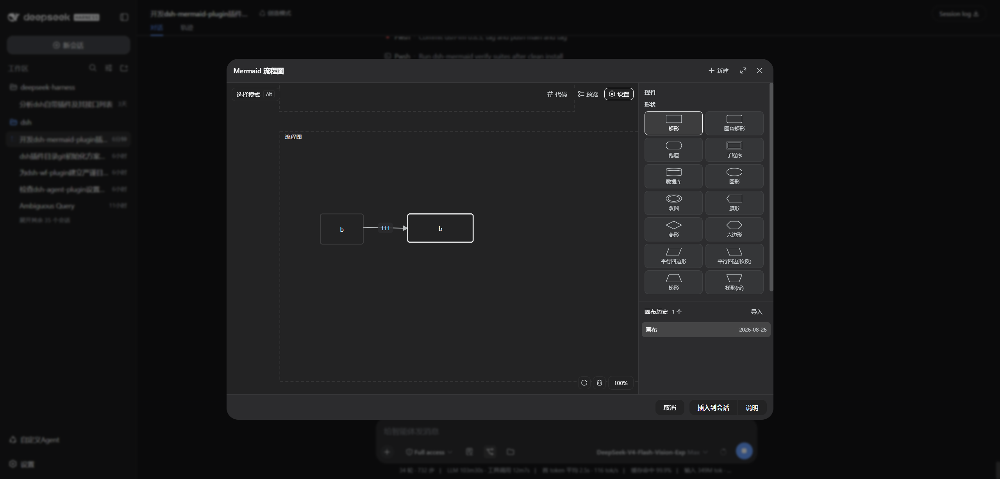

# dsh-flowchart — Mermaid 流程图可视化绘制插件

> **画布绘制 → 实时生成标准 Mermaid 代码 → 预览 / 复制 / 一键插入 dsh 会话**
>
> 画布是输入方式，**Mermaid 代码是唯一产物**（一等公民：任何画布状态恒产出可解析的标准代码，不发明私有扩展）。

[](https://github.com/frankzhan-git/dsh-flowchart)
[](https://github.com/frankzhan-git/dsh-flowchart/actions/workflows/verify.yml)

dsh-flowchart 是 [DeepSeek Harness](https://github.com/deepseek-ai) 的正式插件：会话输入框工具行点「流程图」唤起画板，绘制流程节点与箭头，画布**实时翻译为标准 Mermaid 代码**——带主题/方向/间距配置的 `flowchart` 图，可复制、可在插件内渲染预览（渲染器内置，离线可用）、可一键插入会话输入框随需求发给 agent。

## 📸 产品预览

<p align="center">
  
</p>

---

## ✨ 特性

- **双模式画布**：选择 / 绘制（按住 `Alt` 临时绘制，松开恢复；沿用 dsh-wf 键盘对账，Alt+Tab 不卡死）
- **页面**：页面 = 一个 Mermaid 图；页面外拖拽 = 新建页面（默认 Flowchart）；页面内拖拽 = 建节点；**所有绘制必须在页面内**
- **14 种 Flowchart 形状**：矩形/圆角/跑道/子程序/数据库/圆形/双圆/旗形/菱形/六边形/平行四边形×2/梯形×2（右键缩略图菜单 + 设置面板，语法与 mermaid 官方一致）
- **箭头一等公民**：选择模式贴边拖 = 画箭头（同页吸附连接、跨页红叉取消、起终点锚点归一化、随节点移动自动跟随）；直/弧按进出边对接自动判断；点击选中、`Backspace`/`Delete` 删除、双击编辑居中标签；**选中后首尾出现实心圆点，可按住圆点沿控件边挪动锚点**（脱离吸附松开 = 取消连线）
- **模式即语义（Q1）**：选择模式贴边 = 箭头（无手柄）；绘制模式贴边 = 调整宽高、右下角 = resize
- **组合控件（P8）**：绘制矩形覆盖其他控件 → 松开**自动成组**（组合矩形透明化、成员整体框选）；拖入归组（亮边框反馈，组自动扩展至完全包裹）、拖出解除归属；拖动组合 = 成员整体跟随，组合 resize = 成员等比缩放；**组合文本显示在矩形顶部**（左右居中、与顶边留间距）；代码输出 mermaid `subgraph`（成员递归嵌套）；删除组合只删外框、成员保留散出
- **文本**：双击节点编辑（上下左右居中、`Shift+Enter` 换行 → `<br/>`，随 htmlLabels 配置）
- **画布交互**：平移（空格+拖）/ 缩放（滚轮，右下角 `%` 一键还原）/ 撤销重做 / 框选 / 批量移动 / **批量宽高（外框任意一边）/ 批量等比缩放（右下角）**——选择/绘制两种模式语义一致，全体选中控件跟随
- **代码一等公民（C1–C3）**：任意状态 → `mermaid.parse` 可解析代码；实时刷新；仅输出官方语法 + 非默认配置（front-matter）
- **两个预览浮窗**（画布右上角按钮，画布内浮窗 + 可多页切换）：Mermaid 代码（复制全部）、渲染预览（内置 mermaid 渲染器）
- **插入会话**：引导语 + ```mermaid 代码块（可切「仅代码」档），`inputActions.setDraft` 写入草稿
- **实时落盘（严谨目录管理）**：800ms 防抖自动保存 → `~/.dsh/storages/dsh-flowchart/`（命名空间清单 `MANIFEST.json` + `canvases/{id}.json` 每画布原子写、`.corrupt` 损坏隔离、临时文件启动清扫、meta 缓存）；不污染 storages 顶层；无宿主存储自动降级 localStorage
- **多实例互通**：数据存储「每画布单文件 + 每次操作实时磁盘读」——同一 `DSH_HOME` 下的多个 DSH 实例（如 :3080/:3090 双端口）共享 `~/.dsh/storages/`，刷新即互见、写入互不覆盖（官方 storageDomain 为进程内存态，实测不支持跨实例实时可见，故不采用）
- **画布历史**：右栏（设置 + 历史两区，同 dsh-wf）：最近打开 / 新建 / 重命名 / 删除（二次确认）/ 导出 / 导入
- **类型扩展**：页面类型注册表预留（时序/类图/状态图/ER/甘特/饼/旅行/思维导图/时间线/桑基/象限/Git/看板/通讯/需求 16 种，v1 置灰提示）

---

## 🚀 安装（npm）

**前置**：已安装 DSH（`dsh` 在 PATH）、Node ≥ 20、pnpm。

```powershell
dsh plugin --profile web add dsh-flowchart
```

`dsh plugin` 自动安装依赖并加入 `dsh.profile.bundles`；重启 DSH 后输入框工具行出现「流程图」按钮（插件管理器显示名 "flowchart"）。

> 从源码安装：`git clone https://github.com/frankzhan-git/dsh-flowchart.git && cd dsh-flowchart && npm install && npm run build`，再 `dsh plugin --profile web add "file:<克隆目录绝对路径>"`。

**常见问题**

| 现象 | 解决 |
|---|---|
| 按钮不出现 | 确认 `dsh plugin add` 成功且 bundles 含 `dsh-flowchart` → 重启 DSH |
| 控制台 `Cannot find module` | banner id 与 patch name 不一致 → 重新构建 |
| 保存失败 toast | 宿主存储未生效（需 web profile 含 api-remotes）；或自动降级 localStorage（不影响使用） |
| 画布数据在 `~/.dsh/storages/dsh-flowchart/` | 宿主存储正常（MANIFEST.json + canvases/{id}.json；旧版 mermaid-canvases/ 自动迁移） |

---

## 📖 使用

1. 输入框工具行点 **流程图** → 画板出现（默认一个空白页面）
2. **绘制**：按住 `Alt`（或点左上角徽标切绘制模式）→ 页面内拖拽画矩形节点；页面外拖拽画新页面
3. **连线**：`Esc` 回选择模式 → 按住节点边拖向其它节点，靠近吸附，松开成箭头（跨页 = 红叉取消）
4. **编辑**：双击节点/箭头/页面名改文本；右键 = 更换形状（缩略图）/删除/方向/重命名/复制
5. **预览**：右上角「代码」「预览」按钮 → 浮窗；浮窗内复制（全部）
6. **插入**：底部 **插入到会话**（旁切「说明/代码」档）→ mermaid 代码进输入框，随需求发送
7. 画布数据自动保存；右上角「设置」→ 右栏（设置 + 画布历史）管理文档

| 操作 | 方式 |
|---|---|
| 模式切换 | 长按 `Alt` 临时绘制（松开恢复）或点左上角徽标 |
| 移动节点 | 选择/绘制模式按住主体拖动（不可拖出页面） |
| 画箭头 | 选择模式按住节点边带拖动（同页吸附；跨页取消） |
| 改尺寸 | 绘制模式贴边拖（宽高）、四角手柄（resize） |
| 批量操作 | 空白处框选（完全包含）→ 组内拖动=整体移动；拖外框任意一边=批量宽高（拖上/左边时对缘固定）；拖右下角=批量等比；两种模式下语义一致，全员跟随 |
| 组合控件 | 绘制模式画矩形覆盖控件=松开成组；拖控件入组=归组（组自动扩展）；拖出组外=解除；拖组合=整体移动；组合右下角=成员等比缩放；双击改文本（画布中显示于顶部居中） |
| 撤销/重做 | `Ctrl+Z` / `Ctrl+Shift+Z`（`Ctrl+Y`） |
| 复制/粘贴 | `Ctrl+C` / `Ctrl+V`（节点，偏移 +24） |
| 删除 | `Backspace` / `Delete`（页面 > 箭头 > 节点优先级删除） |
| 平移/缩放 | 空格+拖动 / 滚轮（`Ctrl+滚轮`=缩放）；右下角 `%` 点击一键还原 |
| 插入会话 | 底部主按钮（说明/代码两档） |

---

## 🏗️ 架构（对齐 dsh-wf 七范式）

```
dsh-flowchart/
├── lib/                  # 宿主半（Node：命名空间目录存储 + Typert Remote 网关）
│   ├── index.js          #   Cordis 入口：ctx.get('typert') 可选 → provide/bind/register
│   ├── wire.js           #   线协议单一来源（zod：记录 schema + invocations 双端共用）
│   ├── flowchart-service.js#   CanvasStore 契约 → 目录文件（原子写/meta 缓存/.corrupt 隔离/写链串行）
│   └── typert.host.js    #   宿主线协议贡献（gateway 严格路径）
├── src/
│   ├── client.js         # 宿主适配层（样式注入 + 两槽位注册 + remote.$mount）
│   ├── core/             # 领域层（零 React/DSH）
│   │   ├── model.js      #   Doc/Page/Node/Edge 工厂 + id + reserveSeqs
│   │   ├── geometry.js   #   相机/命中/锚点/箭头几何（直弧判定、贝塞尔）
│   │   ├── interactions.js # 交互状态机（CREATE*/MOVE/RESIZE/ARROW/ANCHOR/MARQUEE/GROUP_*）
│   │   ├── shapes.js     #   14 形状注册表（syntax/minSize/渲染描述子/缩略图）
│   │   ├── grouping.js   #   组合控件纯函数（成组/包裹不变式/拖入拖出归一/推离/渲染排序）
│   │   ├── codegen.js    #   ★ normalize→serialize→validate（C1：恒合法）
│   │   ├── pipeline.js preview.js（mermaid 封装）
│   │   └── storage/      #   CanvasStore 接口 + domain/localStorage 适配器 + 清洗/迁移
│   ├── hooks/            # useDocState/useCanvasInteractions/useCanvasEdit/useCanvasManager/usePreview
│   ├── components/       # 画布组件（CanvasStage/Overlay/NodeRenderer/EdgeRenderer/...）+ 右栏 + 浮窗
│   ├── i18n/ css/        # 文案表（zh）/ --mm-* token 样式
├── scripts/              # build.mjs + 9 套验证（npm run verify 一键全绿）
├── schema.json           # 画布数据契约 Schema（与注册表一致性由测试守护）
```

- 存储（严谨目录管理）：`~/.dsh/storages/dsh-flowchart/` = 插件唯一命名空间（`MANIFEST.json` 清单 + `canvases/{id}.json` 每画布原子写 + `.corrupt` 隔离 + 临时文件启动清扫）；@Remote 网关传输（zod 线协议校验）；localStorage 兜底（键前缀 `dsh-flowchart:`）
- 代码管线：`normalize`（转义/孤儿边剔除/未知形状回退）→ `serialize`（注册表语法 + front-matter 仅非默认）→ `validate`（`mermaid.parse` 浏览器端兜底 + verify-codegen 断言）
- 布局：画布内角落按钮（模式徽标 / 代码·预览·设置 / 撤销·重做·清空·缩放）+ 右栏（设置 + 画布历史）——与 dsh-wf 完全对齐

## 🧪 验证

```bash
npm run verify   # 9 套件一键全绿
```

| 套件 | 覆盖 |
|---|---|
| verify-shapes | 14 形状注册完整性 + mermaid.parse 逐形状 smoke（尽力） |
| verify-codegen | 形状语法/转义（引号/换行/特殊字符）/方向归一/默认值省略/多页/孤儿边 issue/插入文本 |
| verify-interactions | 模式即语义（Q1）/箭头吸附/跨页取消/锚点随动/锚点微调/页面钳制/框选/批量边带（四边×两模式，全员跟随）/批量等比/组内语义/四角 resize/直弧判定 |
| verify-storage | meta/body 往返/增量 patch/排序分页/损坏隔离/清洗/导入导出/迁移 |
| verify-host-storage | 宿主命名空间目录全流程（内存 fs）：MANIFEST/原子写/合并/.corrupt/tmp 清扫/旧目录迁移/清洗 |
| verify-adapter-contract | CanvasStore 契约形状/降级顺序（domain > localStorage）/sync 变体 |
| verify-protocol | 宿主线协议贡献与客户端 descriptors 一致性（wire.js 单源） |
| verify-grouping | 组合几何/绘制成组/拖入扩展/拖出解除/推离/渲染排序/subgraph 输出 |
| verify-perf | 300 节点 + 200 边：codegen < 50ms、sanitize < 100ms |

## 📄 文档

- [产品设计](docs/dsh-flowchart-plugin-design.md) / [架构方案](docs/dsh-flowchart-plugin-architecture.md) / [开发范式](docs/dsh-flowchart-plugin-dev-standards.md) / [开发计划](docs/dsh-flowchart-plugin-plan.md)
- [Mermaid Flowchart 配置矩阵](docs/dsh-flowchart-config-matrix.md)（官方支持 × 插件实现）

## 🤝 参与贡献

欢迎提 [Issue](https://github.com/frankzhan-git/dsh-flowchart/issues) 与 [Pull Request](https://github.com/frankzhan-git/dsh-flowchart/pulls)：

1. Fork 本仓库并新建分支（`feat/<milestone>-<名称>` / `fix/<名称>`）；
2. 开发遵循 [docs/dsh-flowchart-plugin-dev-standards.md](docs/dsh-flowchart-plugin-dev-standards.md)（分层/注册表/纯函数状态机/存储即服务）；
3. 合入前 `npm run verify` 必须全绿 + 产品验收清单逐项勾选（见产品设计第 5 章）。

## 📝 许可证

[MIT](LICENSE) © FrankZhan
