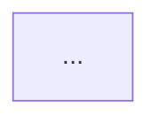

# dsh-mermaid — Mermaid 流程图可视化绘制插件（产品设计方案）

> 状态：设计稿 v1（需求分析 + 产品设计，待用户确认决策点后进入实施）
> 定位：DSH **正式版插件**（profile bundle 层），产出 **Mermaid 代码**（v1 = `flowchart`）
> 参照实现：`dsh-wf-plugin`（画布交互 / 存储 / 插入输入框全链路）、`dsh-fm-plugin`（正式版发布链路 + mermaid 内联渲染）

---

## 第 0 章 需求总览与语义澄清

### 0.1 一句话产品定义 + 代码一等公民定位

> **dsh-mermaid 是一个「画布 → 标准 Mermaid 代码」的翻译器**：用户在画布上绘制「页面 → 控件（流程节点）→ 箭头（流程边）」，插件把画布结构**实时翻译成标准 Mermaid 代码**，用于向模型传递复杂结构图设计需求。
>
> **画布是输入方式，Mermaid 代码是唯一产物出口**——预览、复制、一键插入会话全部以代码为载体。类比 dsh-wf（画布 → JSONL 喂模型）：dsh-mermaid = 画布 → Mermaid 代码喂模型，代码地位与 wf 的 JSONL 完全同级，是**一等公民**。

**代码一等公民 = 三条硬红线（产品承诺，也是测试不变量）：**

| # | 红线 | 含义 |
|---|---|---|
| C1 | 永远合法 | 画布**任何状态**（编辑中途、半成品、多页、空文本、异常字符）都能翻译出**可被 `mermaid.parse` 解析**的标准代码；解析不了时不允许"生成脏代码"，而是自动归一化 + 输出可读的修正说明（issues） |
| C2 | 永远同步 | 每次画布操作后代码**实时刷新**（memo 派生，无手动"生成"步骤）；代码区 / 渲染预览 / 插入内容三处永远同源同刻 |
| C3 | 永远标准 | 只输出 mermaid 官方语法（形状/边/方向/配置全部走注册表 + 官方文档校验），不发明私有扩展；代码可被任何 mermaid 客户端（DSH 会话渲染器、GitHub、draw.io）直接渲染 |

因此产品优先级排序：**画布交互服务于"画得顺手"；codegen 正确性是验收第一优先级**——测试矩阵中 `verify-codegen` 为最高优先级套件，断言任何画布状态 → 合法代码。

### 0.2 需求编号追踪表

| 编号 | 需求 | 出处 | 结论 |
|---|---|---|---|
| R1 | 画布双模式（选择 / 绘制），Alt 按住=临时绘制，松开=恢复选择 | 视图 1 | 直接复用 dsh-wf 双模式状态机（含键盘状态对账） |
| R2 | 页面有类型，默认 Flowchart，未来扩展其它 mermaid 类型 | 视图 2 | v1 仅 Flowchart 可创建/绘制；**页面类型注册表**预留扩展位 |
| R3 | 任何类型绘制前必须先有页面；所有绘制必须在页面内 | 视图 2 | 绘制模式：页面外拖拽=创建页面（默认 flowchart）；页面内拖拽=创建控件 |
| R4 | 绘制模式 + Flowchart 页面：默认控件=矩形；可拖边改宽高；可拖右下角 resize | 视图 4 | **已定（0.4 Q1）**：绘制模式贴边拖=调宽高、右下角角手柄=resize |
| R5 | 选择模式：拖控件主体=移动（不可拖出页面）；拖控件边=绘制箭头；箭头首尾必须连接控件、不可跨页面；触发控件=起点；靠近其它控件可吸附连接；锚点不固定、由鼠标控制；箭头可点选、Backspace/Delete 删除；双击矩形编辑文本（居中、Shift+Enter 换行）；双击箭头编辑标签（居中）；弧线/直线按相连位置自动判断；右键换形状（mermaid 全部 flowchart 形状，缩略图 icon）；右键页面也有菜单 | 视图 5 | v1 核心。**选择模式贴边拖=画箭头、无手柄（0.4 Q1）**；直/弧=Q2 方案 A；锚点归一化 + 跨页取消见 0.5 |
| R6 | 设置面板：按页面类型 + 控件类型提供 mermaid 支持配置项 | 视图 6 | 配置注册表：文档级（主题）+ 页面级（flowchart 配置）+ 控件级（形状/文本）+ 边级（类型/标签） |
| R7 | Mermaid code 预览 + 复制 + 一键插入会话窗口 | 视图 7 / 服务 2-3 | 实时生成代码；`mermaid.render` 预览（错误提示不阻断）；复制到剪贴板；插入 = `inputActions.setDraft` |
| R8 | 鼠键、画布交互：缩放 / 拖动 / 一键还原 / 撤销 / 批量框选 / 批量移动 / 批量宽高 / 批量 resize | 视图 8 | 复用 dsh-wf 交互状态机 |
| R9 | 实时自动保存 + 画布落盘 | 服务 1 | 宿主半命名空间目录（`~/.dsh/storages/dsh-mermaid/canvases/{id}.json` + MANIFEST），@Remote 网关传输，localStorage 兜底 |

### 0.3 与 dsh-wf 的本质差异（决定了不能直接复制，只能复用范式）

| 维度 | dsh-wf（界面草图） | dsh-mermaid（流程图） |
|---|---|---|
| 产出 | JSONL 语义描述（结构树） | Mermaid 代码（节点 + 边 + 配置） |
| 元素结构 | 树形嵌套（页面→容器→控件） | **平铺**（页面 / 节点 / 边 三类集合，无嵌套、无容器） |
| 控件语义 | 18 种 UI 类型 + 自动推断 | 14 种 flowchart 形状 + 类型 = 形状（无推断） |
| 连线 | 无（结构靠嵌套） | **箭头是核心一等公民**（关联绘制、吸附、标注、直/弧判定） |
| 派生 | 代码（**唯一产物出口**，一等公民）| Mermaid 代码 + 渲染预览（布局由 mermaid 引擎决定，见 0.4 Q3） |
| 版面约束 | 页面内控件约束 + 页面间距约束 | 同左；额外：**箭头不可跨页面** |
| 存储记录 | elements 单数组 | pages / nodes / edges **三集合**（patch 三方） |

**关键推导**：dsh-wf 的 `core/geometry + interactions + storage + hooks` 四大范式（P1–P7，见架构方案）**全部复用**；`types/pipeline/jsonl` 三层替换为 `shapes/page-types/edge-kinds/codegen` 注册表 + `buildMermaid` 纯函数。

### 0.4 已确认决策（用户拍板 2025-12，全部定稿）

> 以下为最终结论，实施按此执行。

| # | 决策 | 最终方案 |
|---|---|---|
| Q1 | 「拖边改大小」vs「拖边画箭头」 | **按模式区分（用户自定义）**：① **选择模式**：贴边拖 = **画箭头**，**无任何手柄**（改尺寸不在此模式提供）；② **绘制模式**：贴边拖 = **调整宽高**，右下角角手柄 = **resize**（改大小） |
| Q2 | 直线/弧线判定 | **方案 A**：起点边与终点边对接（A右→B左、A左→B右、A下→B上、A上→B下）且位移主要沿该轴 → 直线；其余 → 弧线 |
| Q3 | 画布布局 ≠ 引擎布局 | **方案 A + 强化**：① Mermaid 代码预览（可一键复制）；② Mermaid 代码的**渲染预览——渲染器内置在插件内**（mermaid 内联进 client bundle，不依赖外部服务）；差异由文案说明（画布=结构，渲染=引擎排版） |
| Q4 | v1 图类型范围 | **方案 A**：仅 Flowchart 可绘制；类型注册表预留，其余类型设置面板置灰 + 提示 |
| Q5 | 插入会话格式 | **方案 A**：引导语 + 标准 mermaid 代码块；按钮旁可切「仅代码」 |

**Q1 细化（实施基线）**：

| 模式 | 节点边带拖动 | 手柄 | 说明 |
|---|---|---|---|
| 选择模式 | 画箭头 | **无** | 尺寸调整入口 = 切到绘制模式 / 设置面板 / 右键菜单数值输入 |
| 绘制模式（创建的节点保持选中态） | 调整宽高 | 右下角角手柄（改大小） | 四边=单边缩放；角=自由/等比 resize |

- 移动：两模式下按住节点**主体**拖动均可移动（选择模式=选中+移动；绘制模式=选中+移动），移动始终不可拖出页面。
- 文本/标签编辑：选择模式双击（节点文本 / 箭头标签），流程不变。

---

### 0.5 已定决策（设计方决定，无需拍板；如认为不妥请指出）

| # | 决策 | 内容 |
|---|---|---|
| E1 | 箭头锚点存储 | `{ side: 'l'|'r'|'t'|'b', t: 0..1 }`（边 + 归一化位置）；节点移动/缩放时箭头端点随边滑动自动跟随，无需手动重连 |
| E2 | 跨页面箭头 | 绘制中指针离开起点页面 → 红叉 + 取消态；松开时命中同页节点（吸附距离内）→ 成边，否则取消（无残留） |
| E3 | 复制节点不连带箭头 | 跨引用复制语义复杂且需求未列；v1 明确边界（README 声明），v1.1 按需 |
| E4 | 无媒体存储 | flowchart 无图片节点，CanvasStore 接口预留 putMedia/getMedia 位 |
| E5 | 元素 id 规则 | 页面 `p*` / 节点 `n*` / 边 `e*` + 模块 seq；载入时 `reserveSeqs` 推进（防复制粘贴 id 冲突，wf 事故） |
| E6 | 显示名 | 包名 `dsh-mermaid`；cordis.patch `name: dsh流程图`（显示名「流程图」）；install.ps1 用字符码构造中文名（同 dsh-fm） |

---

## 第 1 章 信息架构与主界面

### 1.1 入口与布局（对齐 dsh-wf 布局范式）

```
会话输入框工具行（conversation.input.left，order 5）
  └─ [流程图] 按钮 ──open──▶ 画板浮层（conversation.input.overlay，同 wf SketchModal 结构）
        ┌──────────────────────────────────────────────────────────────┐
        │ 顶栏： 标题 |  [新建] [全屏] [关闭]（右上角）                   │
        ├──────────────────────────────────────────────┬───────────────┤
        │ 中栏：画布（SVG 相机，可平移/缩放）            │ 右栏（可折叠， │
        │  ┌────────────────────────────────────────┐  │ 由右上角「设置」│
        │  │ ◤ 左上角：模式徽标 [选择模式 Alt]        │  │ 按钮切换显隐）│
        │  │ ◤ 右上角工具行：[代码] [预览] [设置]      │  │  ▸ 设置       │
        │  │ ◢ 右下角：撤销·重做·清空 | [100%]        │  │    （文档/页面/│
        │  │    （缩放%，点击即一键还原 100%）        │  │     节点/箭头）│
        │  │ ◉ 浮窗（居中，头部复制/关闭，右下角可     │  │  ▸ 画布历史   │
        │  │    拖拽 resize，多页下拉切换）：          │  │    （最近打开/ │
        │  │    · Mermaid 代码（只读+高亮+行号）      │  │     新建/重命名│
        │  │    · 渲染预览（内置渲染器）              │  │     /删除/导出│
        │  │ 画布内容：页面虚线框·节点·箭头·吸附虚线·  │  │     /导入，高度│
        │  │          框选矩形·多选外框·行内文本浮层  │  │     可拖）     │
        │  └────────────────────────────────────────┘  │               │
        ├──────────────────────────────────────────────┴───────────────┤
        │ 底栏：  [取消/关闭]        [插入到会话]（主按钮）· [仅代码] 切换 │
        └──────────────────────────────────────────────────────────────┘
```

**布局要点（与 dsh-wf 完全对齐）**：

- **画布相关功能都挂在画布内各角定位按钮上**（CanvasOverlay 范式，同 wf）：左上角模式徽标、右上角工具行（代码 / 预览 / 设置）、右下角（撤销/重做/清空 + 缩放百分比）。
- **右侧边栏只有两区**（RightPanel 范式，同 wf）：`设置`（文档/页面/节点/箭头）+ `画布历史`（文档管理列表）；高度可拖拽分区；由右上角「设置」按钮整体显隐。
- 代码 / 渲染预览是**画布内浮窗**（wf-float-panel 同款），不是右栏标签页：右上角按钮唤起，头部有「复制」「关闭」，右下角可拖拽 resize，多页面下拉切换。
- 其它交互：画板浮层为会话输入框锚定浮层；`Esc` 先退全屏再关浮层；插入入口在底栏主按钮（同 wf footer）；撤销/重做 `Ctrl+Z` / `Ctrl+Shift+Z`（`Ctrl+Y` 等价）；删除 `Backspace`/`Delete`；复制粘贴 `Ctrl+C`/`Ctrl+V`（偏移 +24）；平移 = 空格 + 拖动；缩放 = 滚轮（视口中心锚定，0.25–3）。

### 1.2 文档 / 页面 / 元素三级模型

```
画布文档 Canvas（= 一份文档 = 一屏画布，落盘单位）
 ├─ pages[]   页面（= 一个 Mermaid 图）：type / direction / 位置 / 配置
 │   ├─ nodes[]  节点（= 一个 flowchart 形状 + 文本）：shape / x,y,w,h / text
 │   └─ edges[]  箭头（= 一条有向边）：from / to / 锚点 / label / kind
 └─ config：全局主题（theme / fontFamily / themeVariables 预留）
```

- **页面是唯一图容器**：节点、箭头必须属于且只属于一个页面（记录 `pageId`）；跨页引用在交互层禁止（E2）、在代码生成层防御（生成时丢弃孤儿并报 issue）。
- 无嵌套、无容器、无 z 序管理（节点渲染顺序=数组顺序，顶层在后；箭头层永远在节点层下方，保证命中优先节点）。
- 文档名仅管理用，**绝不注入 Mermaid 代码**（同 wf 原则⑥）。

---

## 第 2 章 交互规格（视图层）

### 2.1 模式机制（R1）

| 项 | 规格 |
|---|---|
| 基底模式 | 选择（默认）；用户可经左下角模式徽标切换到常驻绘制 |
| 临时绘制 | 按住 `Alt` 进入绘制，松开恢复基底模式；松键即回到选择模式 |
| 键盘对账 | 复用 dsh-wf 对账模型：`blur` 修剪键态、`focus`/`mousedown` 用 `getModifierState('Alt')` 重建（防 Alt+Tab 卡死绘制模式） |
| 不变量 | 画布聚焦时只要 Alt 实际未按住，模式必为基底模式 |

### 2.2 绘制模式行为（R2/R3/R4）

| 按下位置 | 行为 |
|---|---|
| 页面外画布 | 拖拽 → **创建页面**（默认类型 `flowchart`，默认尺寸 480×320，默认方向 `TD`） |
| 页面内空白 | 拖拽 → **创建节点**（默认形状 `rectangle`，默认尺寸 120×48） |
| 页面内命中已有控件主体 | 仅选中（不允许在其上创建，防误叠） |
| 空拖拽（过小） | 结算时取消（≤4px） |

创建完成后（绘制模式下节点保持选中态，0.4 Q1 语义）：
- **贴边拖** → 调整宽/高（对应边缩放，对侧锚定）；**右下角角手柄** → resize（自由/等比）；
- 选择模式**无手柄**：尺寸调整需切入绘制模式，或用设置面板 / 右键菜单数值输入。
- 拖动算法完全复用 dsh-wf：最小尺寸钳制（每种形状有注册表 `minSize`）、页面边界钳制、移动边对齐吸附（容差 6/zoom）。

### 2.3 选择模式行为（R5）

#### 2.3.1 节点移动

- 按住主体（含未选中时的边带区）= 选中 + 移动；**不可拖出所属页面**（贴边即停，复用 `clampToPage`）。
- 选择模式**不提供尺寸手柄**（0.4 Q1）：节点主体=移动、节点边带=画箭头；调整尺寸请切到绘制模式（贴边拖 / 右下角手柄）或设置面板/右键菜单数值输入。
- 移动支持 6 向对齐吸附（左/右/水平中/上/下/垂直中，容差 6/zoom）+ 吸附虚线；吸附目标 = 同页其它节点 + 所属页面边界；多选移动时排除组内元素。
- 节点移动时，关联箭头端点随锚点自动重算（E1）——箭头跟随是"连接语义"不变量。

#### 2.3.2 箭头绘制（核心新交互）

流程（纯函数状态机，事件表见架构方案第 5 章）：

```
pointer.down(节点边带, 选择模式；选择模式无手柄)
  → 锁定起点：sourceNode + fromAnchor{side,t}（锚点 = 鼠标落点所在边 + 归一化位置）
  → phase = ARROW_DRAW，实时渲染虚线预览箭头（+ 箭头头）
pointer.move
  → 命中解析：同页其它节点边带（吸附距离 = 10/zoom）→ 高亮候选节点 + 吸附线 + 锚点预览
  → 指针离开 source 页面 → 红叉提示（取消态）
  → 指针仍在 source 页面但未命中候选 → 正常预览（自由端点 = 鼠标位置）
pointer.up
  → 候选目标存在（同页节点）→ 创建 edge（from/source, to/target, 双向锚点, kind='solid', label=''）
  → 候选目标不存在 / 跨页 / 起终点相同 → 取消（不创建、不报错、无残留）
  → history.commit
```

规则细化：

| 规则 | 实现 |
|---|---|
| 触发控件 = 起点 | 按下时命中的节点即 `from`，源锚点取按下点在该节点边框上的吸附值 |
| 锚点由用户控制 | 起点/终点均为「鼠标位置 → 节点边 + 归一化 t」投影；用户从哪条边拉出、放到哪条边自由决定 |
| 吸附连接 | 指针距同页其它节点边框 ≤ 10/zoom 时吸附：显示候选节点高亮 + 连接点圆点，松开即成边 |
| 跨页禁止 | 离开起点页面即进入取消态；跨页松开 = 取消 |
| 直/弧 | Q2 规则（对接朝向 → 直线；其余 → 弧线），实时随拖动切换（拖动中预览即同步直/弧形态） |
| 箭头删除 | 点击箭头（命中 = 路径折线采样 8/zoom 内）→ 选中高亮；`Backspace`/`Delete` 删除（含标签） |
| 箭头标签 | 双击箭头 → 行内文本框浮在路径中点；`Enter` 提交、`Esc` 取消；文本居中于箭头（SVG：路径中点 + `text-anchor: middle`） |
| 锚点微调 | 选中箭头 → 首尾出现实心圆点手柄；按住手柄沿控件边挪动（投影归一化 `{side, t}`，支持跨边切换 side，箭头实时预览）；**脱离控件边吸附并松开 = 取消连线**；吸附态松开 = 按圆点位置确定锚点。手势优先级：锚点圆点 > 节点边带（贴边圆点不误触发「箭头起笔」） |

#### 2.3.3 节点文本编辑（R5）

- 双击节点 → 行内文本框（覆盖节点中央）；**文本相对节点上下、左右居中**；`Shift+Enter` 换行（`Enter` 提交、`Esc` 取消、失焦提交）。
- 存储：`text` 字段以 `\n` 分隔多行（原始数据）；Mermaid 代码生成时按配置转 `<br/>`（htmlLabels=true）或直接多行引号字面量（htmlLabels=false 时转义）。

#### 2.3.4 右键菜单（R5/R2）

- **节点右键**：`更换形状`（级联子菜单 = **14 种形状缩略图 icon 网格**，2 列 × 7 行；每个缩略图 = SVG 微渲染，选中项高亮）、`删除`。
- **页面右键**：`重命名`、`方向`（TB/TD/BT/RL/LR 单选子菜单）、`删除页面`（连带删除节点与箭头，二次确认）、`复制页面代码`。
- 空画布右键：`新建页面`、`粘贴`。
- 菜单定位为浮层，`backdrop` 点击关闭必须 `stopPropagation`（防整窗关闭，dsh-wf 历史教训）。

### 2.4 批量操作（R8）

| 操作 | 交互 |
|---|---|
| 框选 | 空白处拖拽（完全包含结算，同 wf）；`Ctrl`+点击精准多选 |
| 批量移动 | 多选（≥2）后组内任意位置拖动 = 整组移动（组内元素不互相吸附，仅与组外吸附）；页面边界钳制按各元素所属页面 |
| 批量宽/高 | 拖多选外框**四边** = 单轴批量改尺寸（右边/下边移动 = 宽高增减；左边/上边移动 = 对侧锚定；逐控件最小尺寸钳制；吸附对齐非选中元素） |
| 批量 resize | 拖多选外框**四角** = 统一等比缩放（锚定对角，scale 0.1–10；wf 曾移除四角等比，本产品恢复以覆盖 R8「批量修改 resize」） |
| 撤销/重做 | 快照式历史栈（paste/future），CREATE/MOVE/RESIZE/ARROW/EDIT/DELETE 结算时 commit；撤销包含代码预览与预览渲染联动刷新 |

### 2.5 缩放/平移/还原（R8）

- 相机模型同 dsh-wf：SVG 固定视口 + `viewBox` 随 `zoom/pan` 变化；`toLocal`/`zoomAt`/`computePan` 纯函数直接移植。
- 缩放控件 = **画布右下角缩放栏**（同 wf `wf-zoom-bar`）：显示当前百分比；非默认时高亮可点，**点击即一键还原 100% + 平移归零**；滚轮缩放（视口中心锚定，0.25–3）。

---

## 第 3 章 功能规格

### 3.1 形状注册表（R5「mermaid 支持的所有 flowchart 形状」）

v1 注册 14 种（以 mermaid 官方语法为准，实施期用 `mermaid.parse` 逐项验证兜底）：

| ShapeId | 中文名 | Mermaid 语法 | 画布渲染 |
|---|---|---|---|
| `rectangle` | 矩形 | `A[text]` | rect |
| `rounded` | 圆角矩形 | `A(text)` | rect rx |
| `stadium` | 跑道 | `A([text])` | rect rx=rs |
| `subroutine` | 子程序 | `A[[text]]` | rect 双边框 |
| `cylinder` | 数据库 | `A[(text)]` | 圆柱 |
| `circle` | 圆形 | `A((text))` | circle |
| `doubleCircle` | 双圆 | `A(((text)))` | circle 双环 |
| `asymmetric` | 旗形 | `A>text]` | 旗形 path |
| `diamond` | 菱形 | `A{text}` | rhombus |
| `hexagon` | 六边形 | `A{{text}}` | hexagon |
| `parallelogram` | 平行四边形 | `A[/text/]` | 左斜 |
| `parallelogramAlt` | 平行四边形(反) | `A[\text\]` | 右斜 |
| `trapezoid` | 梯形 | `A[/text\]` | 梯形 |
| `trapezoidAlt` | 梯形(反) | `A[\text/]` | 梯形反 |

- 每项注册：`{ id, label, syntax(label), minSize, render }`；`syntax` 纯函数 → 代码生成与注册测试同源。
- 缩略图：`shapeThumb(shapeId)` 纯函数生成 SVG（12×12 视口微渲染），右键网格与形状选择器共用。

### 3.2 边类型注册表（v1）

| EdgeKind | 中文名 | 语法 | 说明 |
|---|---|---|---|
| `solid` | 实线箭头 | `A --> B` | 默认 |
| `dotted` | 虚线箭头 | `A -.-> B` | |
| `thick` | 粗线箭头 | `A ==> B` | |
| `open` | 无箭头连线 | `A --- B` | 无箭头头 |

- 标签语法：`A -- 标签 --> B`；有标签才输出。
- 未来扩展：`--o`（圆头）/`--x`（叉头）/`--*`（星头）/ 双向箭头（`<-->`）——注册表加行即得。

### 3.3 Mermaid 代码生成（R7，纯函数 `buildMermaidCode`）

输出（一页一图，多页多块）：

````
---
config:
  theme: forest
  flowchart:
    curve: basis
    nodeSpacing: 50
    rankSpacing: 50
    useMaxWidth: true
---
flowchart TD
    m12["申请"]
    m17([审批])
    m24{通过?}
    m12 -- 提交 --> m17
    m17 -- 是 --> m24
    m24 -- 否 --> m12
````

规则（全部纯函数 + 单测；**C1 硬保证**：任意输入状态先归一化再序列化——非法文本转义、孤儿边删除并记 issue、空 shape 回退 `rectangle`、缺失引用节点补占位——保证输出恒可被 `mermaid.parse` 解析；`mermaid.parse` 由 verify-codegen 对每个测试用例实际执行兜底）：

| 规则 | 说明 |
|---|---|
| 节点 id | 元素记录 id（`m12` 形）；首字符字母、仅 `[A-Za-z0-9_-]`（记录 id 生成时就满足，生成器 sanitize 兜底） |
| 标签转义 | 文本含空格/`"`/`{}`/`[]`/`()`/`|` 等一律双引号并转义 `"`→`#quot;`；`\n`→`<br/>`（htmlLabels=true）或 `\n` 字面量（htmlLabels=false）；空文本 → 空引号 `""` |
| 形状 | `A[text]` 等语法由形状注册表 `syntax()` 产出（与缩略图/画布渲染共用注册项） |
| 边 | `A -- label --> B`；kind 映射见 3.2；**首尾控件缺一（孤儿边）→ 生成器跳过并输出 issue**（防御，正常交互不会产生） |
| 方向 | 页面级 `figdirection`：TB/TD 输出 `TD`（别名）、BT/RL/LR 原样 |
| 配置 | 文档级 `theme/fontFamily` + 页面级 `flowchart.*` 合并为 front-matter `config`（v11 支持）；仅输出**非默认值**（默认值省略，代码最短） |
| 多页 | 每页一个代码块，页名前缀注释 `%% 页面：<name>` |

### 3.4 预览 / 复制 / 插入（R7）——全部为画布内「角落按钮 + 浮窗」范式（同 wf）

| 功能 | 规格 |
|---|---|
| 入口按钮 | 画布右上角工具行：`[代码]`（Mermaid 代码浮窗）· `[预览]`（渲染预览浮窗）· `[设置]`（右栏显隐开关）——同 wf CanvasOverlay 工具行 |
| Mermaid 代码浮窗 | 画布内浮窗（wf-float-panel 同款：居中、头部「复制/关闭」、右下角拖拽 resize、多页下拉切换）：只读 `<pre>` + 轻量高亮 + 行号；与画布编辑联动刷新（memo 派生） |
| 渲染预览浮窗 | **渲染器内置在插件内**（mermaid 内联进 client bundle，同 dsh-fm 策略，不依赖外部服务/网络）；`mermaid.render(uniqId, code)`（`securityLevel: 'strict'`）+ **500ms 防抖**；成功 → SVG 注入；失败 → 错误摘要 + 引导切到「代码」浮窗；多页下拉切换 |
| 复制 | 浮窗头部「复制」按钮（同 wf copyPrompt）：代码浮窗=复制当前页/全部（下拉切换，记忆上次）；预览浮窗=复制当前页代码；`navigator.clipboard.writeText` + toast |
| 插入会话 | 底栏主按钮（同 wf footer 插入）：`buildInsertText(pages)` = 引导语 + 全部页代码块 → `inputActions.setDraft(当前草稿 + 文本)` → 关闭浮层；主按钮右侧小箭头切「仅代码」档（Q5 方案 A） |

插入文本模板（默认「带说明」档）：

````
按以下 Mermaid 图完成（请先理解图结构，再执行相应改动）：

````

### 3.5 设置面板（R6）——右栏「设置」区（同 wf InspectorPanel）

「设置」按钮切换右栏显隐；右栏上半区 = 设置，按选中项动态分节（`PropField` 注册表驱动）：

| 层级 | 配置项（v1） | 说明 |
|---|---|---|
| 文档 | 主题 theme（default/neutral/dark/forest/base）、字体 fontFamily | 全局 |
| 页面 | 类型（flowchart 可改，其它类型置灰待支持）、方向 direction、curve（basis/linear/cardinal/monotoneX/monotoneY/step/stepAfter/stepBefore）、nodeSpacing、rankSpacing、padding、useMaxWidth、htmlLabels | `flowchart.*` 全部 mermaid 支持项 |
| 节点 | 形状（下拉 + 缩略图）、文本、宽高（数值） | 形状与右键菜单同源 |
| 箭头 | 类型（solid/dotted/thick/open）、标签文本 | 选中箭头时显示 |

- 未来类型页面：每类型在注册表声明 `configSchema`（e.g., sequence 的 `sequenceConfig`），设置面板自动渲染。
- `themeVariables`/`classDef`/`linkStyle` 等进阶项：v1 不在 UI 暴露（数据模型 `config.advanced` 透传位保留，v1.1 提供代码编辑器）。

### 3.6 文档管理（服务层 R9）——右栏「画布历史」（同 wf DocumentPanel）

- 右栏下半区 = 画布历史：最近打开、新建、重命名（双击）、删除（二次确认）、导出（CanvasFile JSON）、导入（重建 id 绝不覆盖）；分区高度可拖（同 wf RightPanel histH）。
- 自动保存：800ms 防抖 + dirty 集合（变更的 pages/nodes/edges 记录 id）→ 增量 patch 写入；关闭浮层 `flushSave`；宿主写链串行（读-改-写）双保险。
- 落盘：**命名空间目录管理**——`~/.dsh/storages/dsh-mermaid/`（MANIFEST.json 清单 + `canvases/{id}.json` 每画布原子写 + `.corrupt` 损坏隔离 + 临时文件启动清扫；旧版 `storages/mermaid-canvases/` 启动一次性迁移，只入不覆盖）；无宿主存储 → localStorage 兜底。

---

## 第 4 章 边界与生命周期

### 4.1 打开 → 编辑 → 关闭

```
CLOSED ─open─▶ OPEN ─载入最近文档─▶ READY ─(800ms 自动保存/ 编辑不断)─▶ ...
  ▲              │                                   │
  └──Esc/backdrop/关闭 关闭时 flushSave◀──FULLSCREEN （Esc 先退全屏）
```

- 载入：`getMeta`（轻量）→ `loadBody`（正文）→ `reserveSeqs` 推进 id 序（防复制粘贴 id 重复，wf 教训）。
- 关闭：`flushSave()` + 释放渲染 DOM（mermaid 产物）。

### 4.2 v1 明确不做（Out of scope）

| 项 | 原因 | 未来 |
|---|---|---|
| 代码 → 画布反向解析（粘贴 mermaid 代码导入） | 可用 `mermaid.parse` AST 但 v1 需求未列 | v2：粘贴代码 → 解析 AST → 重建节点/边 |
| 非 flowchart 类型的交互绘制 | 需求明确"未来再拓展" | 类型注册表 + 各自交互插件 |
| 节点样式（fill/stroke）、classDef、linkStyle、子图（subgraph）、HTML 标签节点 | 需求未列；mermaid 配置项爆炸 | v1.1 按设置面板注册表迭代 |
| 图片/emoji 节点、方向键特殊箭头头（--o/--x） | 同上 | v1.1 边注册表加行 |
| 媒体外置（putMedia/getMedia） | flowchart 无图片控件 | 与 dsh-wf 同接口预留 |
| 多窗口协同 | 无需求 | – |

### 4.3 风险清单

| 风险 | 等级 | 应对 |
|---|---|---|
| mermaid 渲染与画布布局差异造成误解（Q3） | 中 | 产品文案明示「画布=结构，预览=引擎布局」；预览与代码并排，可复制可插入 |
| bundle 体积（mermaid ~1.5–2.5MB 内联） | 中 | 与 dsh-fm 同策略（内联）；v1.1 评估按需加载（mermaid 单独一个 `__ModuleLoader__.load` 条目，预览 lazily load） |
| 精确形状语法随 mermaid 版本漂移 | 低 | 形状注册表 + 验证脚本用 `mermaid.parse` 逐形状 smoke；锁定 mermaid 版本（^11.4.1 同 dsh-fm） |
| 边带语义（0.4 Q1：模式即语义） | 中 | 首次使用引导 tooltip：「选择模式贴边拖=画箭头；绘制模式贴边拖=调尺寸」；选择模式无手柄，改尺寸需切绘制模式（设置面板/右键数值输入兜底） |
| 性能（300 节点 + 200 边） | 低 | 管线纯函数 + memo；基准 <50ms（沿 wf verify-perf） |

---

## 第 5 章 验收清单（产品视角）

0. [ ] **代码一等公民（C1—C3）**：任意编辑中途/完成后，「代码」浮窗内代码均能被 `mermaid.parse` 解析；删除/移动/改形状/改文本/编辑箭头后代码立即更新；副本/空页/多页输出符合标准
1. [ ] Alt 按下即绘制模式、松开即选择（含 Alt+Tab 往返不卡死）
2. [ ] 页面外画拖 = 创建 flowchart 页面；页面内拖 = 创建矩形节点；未先建页面画不出节点
3. [ ] **模式即语义（Q1）**：选择模式贴边拖=画箭头、无手柄；绘制模式贴边拖=调宽高、右下角角手柄=resize；节点不可拖出页面、最小尺寸钳制
4. [ ] 箭头：选择模式边框按下起笔、靠近其它节点吸附、跨页红叉取消、松开空白取消；点击选中、Delete/Backspace 删除
5. [ ] 节点文本：双击编辑、居中显示、Shift+Enter 换行；箭头标签：双击编辑、恒居中于路径
6. [ ] 直/弧：水平相邻 → 直线，其余 → 弧线（拖动中实时切换正确）
7. [ ] 右键：节点 → 14 形状缩略图网格；页面 → 重命名/方向/删除/复制代码
8. [ ] 批量：框选、组移动、拖外框四边批量宽高、拖四角批量等比、撤销/重做
9. [ ] 设置面板：主题/方向/curve/间距/htmlLabels/useMaxWidth 等生成进 front-matter 且生效
10. [ ] 代码生成：形状语法、转义（空格/引号/换行）、方向、默认值省略；多页多块
11. [ ] 预览浮窗：右上角「代码」「预览」按钮唤起画布内浮窗（头部复制/关闭、右下角拖拽 resize、多页下拉）；渲染成功/错误不白屏、500ms 防抖、渲染器内置（离线可用）
12. [ ] 复制：浮窗头部按钮（当前页/全部切换）；底栏「插入到会话」= 引导语+代码块（或仅代码档）草稿拼接 + 关闭浮层
13. [ ] 自动保存 800ms；刷新后重开恢复；`~/.dsh/storages/dsh-mermaid/canvases/{id}.json` 存在且原子写（MANIFEST.json 生成）
